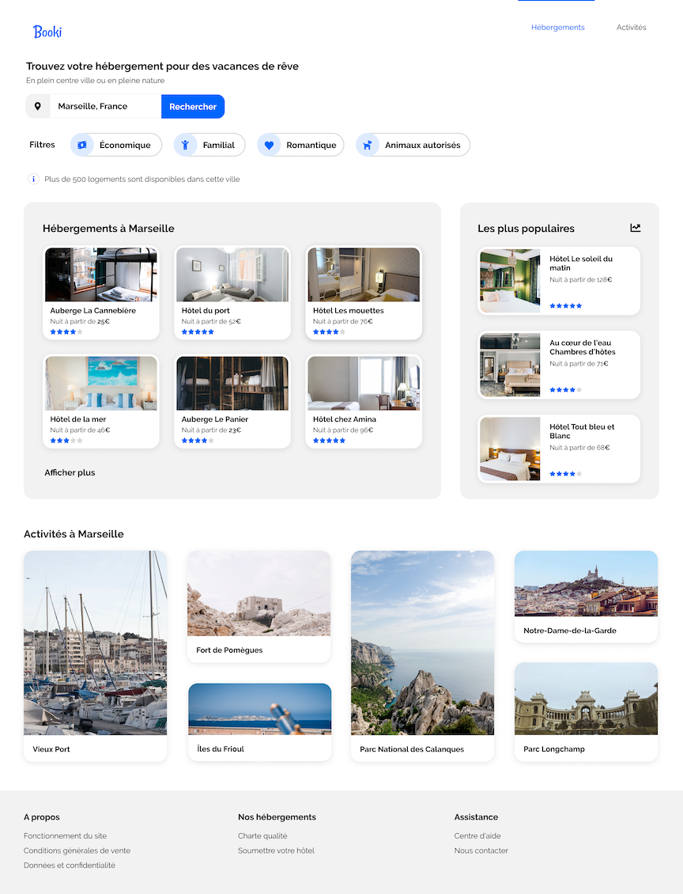

# Transformer une maquette en site web (HTML & CSS)

## Description

Réalisation d'un site web (design seulement) sur la base d'une maquette (voir plus bas).

## Contraintes

N'utiliser que le HTML et CSS de base. Pas de préprocesseur.

## Compétences évaluées

- Implémenter une interface responsive
- Intégrer du contenu conformément à une maquette

